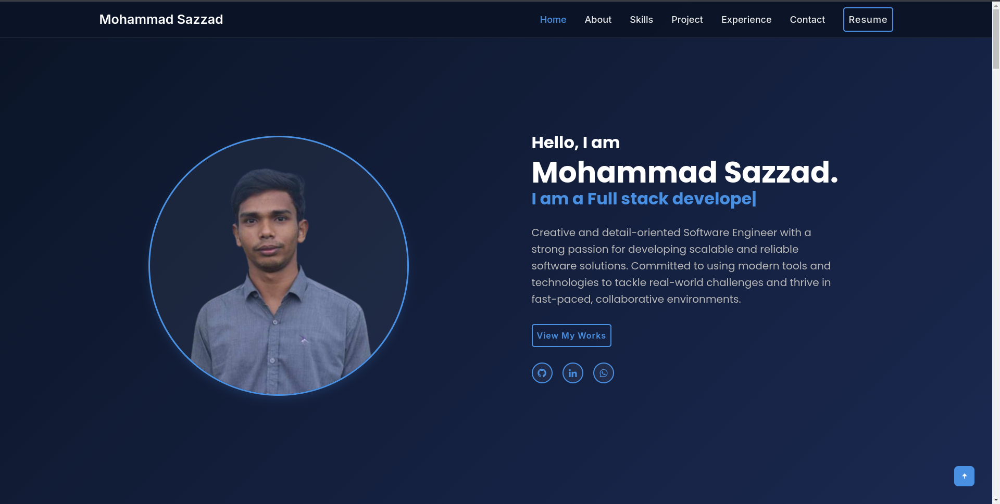

# PortfolioJS

A modern, fully responsive developer portfolio built with HTML, CSS, and JavaScript.

## Features

- Professional, mobile-first design
- Project showcase with images, tech stack, and live/code links
- Skills section (Languages, Frameworks & Libraries, Tools)
- Achievements and certifications
- Contact section with social links
- Modal mobile navigation
- Smooth scrolling and section navigation
- Custom favicon and branding

## Folder Structure

```
PortfolioJS/
├── index.html
├── style.css
├── main.js
├── README.md
├── [images and assets]
```

## How to Use

1. **Clone the repository:**
   ```bash
   git clone https://github.com/MohammadSazzad/PortfolioJS.git
   ```
2. **Open `index.html` in your browser.**
3. **Customize:**
   - Update your projects, skills, and achievements in `index.html`.
   - Replace images in the root folder as needed.
   - Edit styles in `style.css` for further customization.

## Technologies Used

- HTML5
- CSS3 (Flexbox, Grid, Responsive Design)
- JavaScript (ES6+)
- [Boxicons](https://boxicons.com/) for icons

## Screenshots



## Credits

- Design and code: Mohammad Sazzad
- Icons: [Boxicons](https://boxicons.com/)

## License

This project is open source and free to use for personal portfolios.